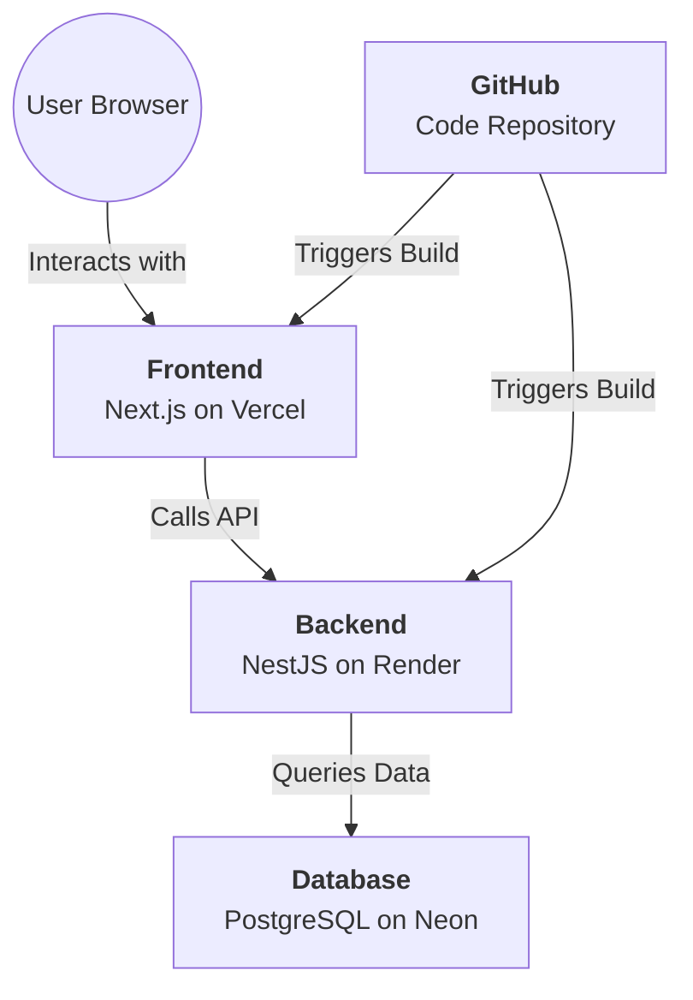

# 🚀 Full-Stack Deployment Roadmap (Learner's Edition)

Welcome to the final stage! Deploying a full-stack app like the **Call Center Management System** involves moving your code from your computer (Local) to the Internet (Production).

Here is your high-level roadmap to understanding how everything fits together.

---

## 🏗️ The Production Architecture

Before we start, understand the "Four Pillars" of your app in the cloud:

---

## 🗺️ The 6-Step Roadmap

### 1. 📦 Code Hosting (GitHub)
**The Concept**: Think of GitHub as a cloud-based "vault" for your code.
- **Why?** Vercel and Render connect to GitHub. Whenever you push new code, they automatically "see" it and update your website.
- **Learner Tip**: This is called **CI/CD** (Continuous Integration / Continuous Deployment).

### 2. 🗄️ Cloud Database (Neon)
**The Concept**: Your local PostgreSQL only lives on your machine. You need a database that is always online.
- **Why?** Neon provides a "Serverless" PostgreSQL. It's fast, free-tier friendly, and works perfectly with Prisma.
- **Learner Tip**: You will get a `DATABASE_URL`. This is the "key" your backend uses to talk to the database.

### 3. ⚙️ Backend Engine (Render)
**The Concept**: This is where your NestJS API lives. It handles logic, security, and talking to the database.
- **Why?** Render is great for Node.js apps. It manages the server, installs your dependencies, and keeps the API running 24/7.
- **Learner Tip**: The backend needs to know where the database is (via an Environment Variable).

### 4. 🎨 User Interface (Vercel)
**The Concept**: This is the "Face" of your app that users see.
- **Why?** Vercel created Next.js, so they provide the best hosting for it. It's incredibly fast and handles all the complex Next.js features.
- **Learner Tip**: The frontend needs to know the URL of your Backend (via `NEXT_PUBLIC_API_URL`).

### 5. 🔗 The "Secret" Connection (Environment Variables)
**The Concept**: You should NEVER put passwords or secret URLs directly in your code.
- **Why?** We use `.env` files locally, but in production, we enter these "secrets" directly into the Vercel and Render dashboards.
- **Learner Tip**: This keeps your app secure while allowing the components to find each other.

### 6. 🚦 CORS (The Security Guard)
**The Concept**: Browsers block websites from talking to different APIs for security.
- **Why?** You must tell your Backend (Render) that it's okay to accept requests from your Frontend (Vercel).
- **Learner Tip**: We configure this in `main.ts` in the backend.

---

## 🛠️ Ready to start?

Now that you have the "Big Picture," follow the step-by-step commands in your **[Deployment Guide](file:///C:/Users/Ali%20Raza/.gemini/antigravity/brain/c50553ce-9e2b-46db-9efb-d864755167f5/DEPLOYMENT_GUIDE.md)**.

> [!TIP]
> **Learning Strategy**: Don't just copy-paste! As you perform each step in the guide, look back at this roadmap to remind yourself which "Pillar" you are building.

**You've got this!** 🚀
